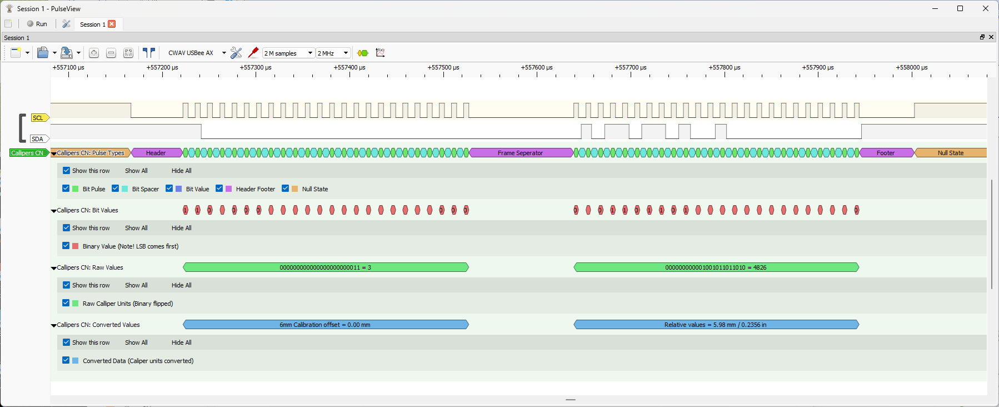

# 🛠️ Chinese Digital Caliper Decoder (PulseView)



This project provides a timing-based protocol decoder for Chinese digital calipers, designed for use with [PulseView](https://sigrok.org/wiki/PulseView) and the Sigrok decoding framework. It classifies pulse types, extracts raw binary values, and converts caliper units into metric and imperial formats — all with accessibility and clarity in mind.

---
## 🎥 Demo Video

[Tim's Digital Calliper Interface [Protocol CN]](https://youtu.be/M7SdDR3ZtSE)

---

## 📦 Features

- **Timing-based pulse classification** (Bit Pulse, Spacer, Header/Footer)
- **LSB-first binary decoding** with two’s complement correction
- **Raw unit extraction** and conversion to mm/inch
- **Frame indexing** to distinguish calibration vs. measurement
- **Null state detection** for burst framing
- **Beginner-friendly annotations** with hover tooltips

---

## 📁 Folder Structure

```
PulseView_Chinese_Callipers_Decoder/
│── calliper_CN/
│   ├── __init__.py          # Sigrok decoder registration
│   └── calliper_CN.py       # Main decoder logic
├── Images/
│   └── Calliper_CN.png      # Protocol overview diagram
├── samples/                 # Optional: test captures (.sr/.srzip)
├── docs/                    # Optional: glossary, usage notes
├── .gitignore
└── README.md
```


Code

---

## 🧮 Conversion Logic

```python
# Metric: raw * 2 / 1613
# Imperial: raw * 2 / 40970
```
These values are empirically derived from caliper output and may vary slightly across models. The decoder emits both converted values and raw binary for transparency.

🧑‍🏫 Teaching Focus
This decoder is built with accessibility in mind:

Clear annotation labels with hover hints

Binary decoding notes for LSB-first protocols

Calibration offset labeling for 6mm reference frames

Structured for reproducibility and beginner learning

📜 License
This project is licensed under the MIT License. You are free to use, modify, and distribute — just keep attribution to Tim Jackson.1960.

🚀 Getting Started
Clone the repo:

bash
git clone https://github.com/yourusername/pulseview-caliper-decoder.git
Copy the calliper_CN folder into your Sigrok decoder directory:

Code
~/.local/share/libsigrokdecode/decoders/
Open PulseView and load your logic capture

Add the decoder and select Callipers CN from the list

View annotations and converted values in the signal rows

🙌 Contributions & Feedback
Pull requests, bug reports, and glossary suggestions are welcome. If you’ve adapted this decoder for other caliper models or added unit auto-detection, feel free to share!
